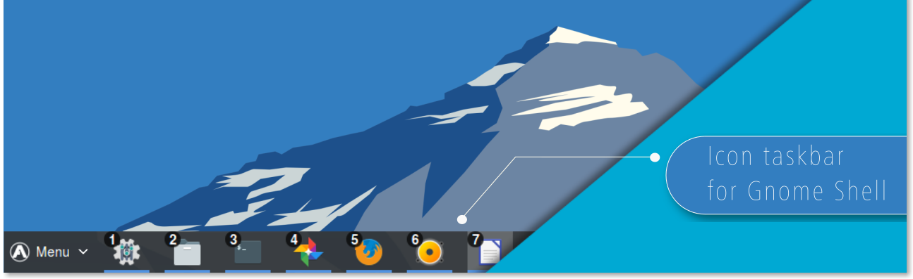
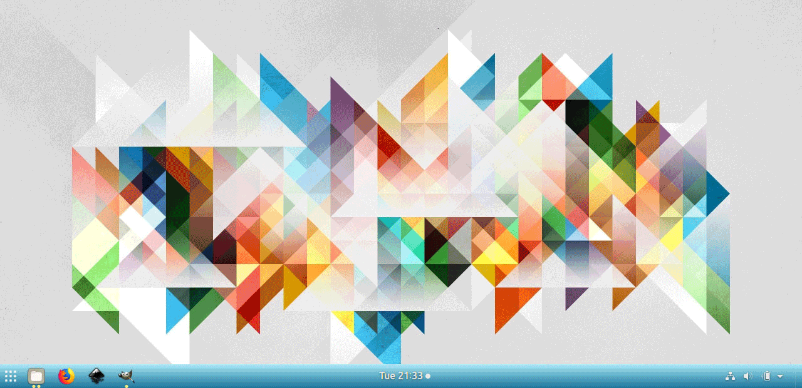
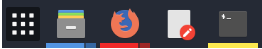
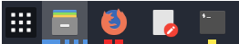
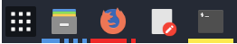
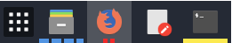
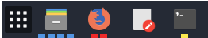
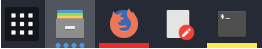
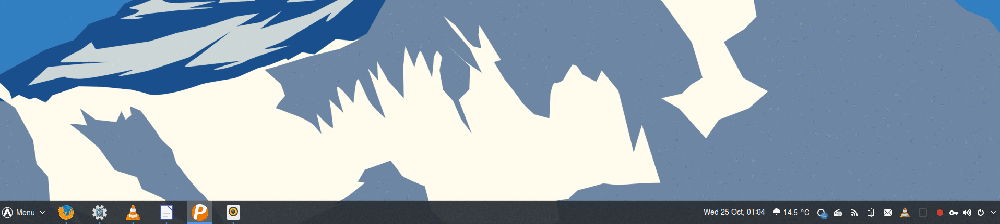
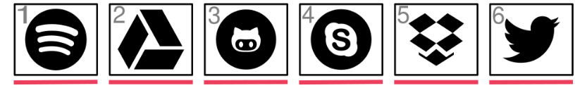

  

    
    

### Introduction

Dash to Panel is an icon taskbar for Gnome Shell. This extension moves the dash into the gnome main panel so that the application launchers and system tray are combined into a single panel, similar to that found in KDE Plasma and Windows 7+. A separate dock is no longer needed for easy access to running and favorited applications. 

Beyond that, just about every aspect of the panel is fully customizable. From positioning and scaling panel elements to running indicators to multi-monitor display, to window previews and even intellihide, Dash to Panel has everything you need to make your workspace feel like home.

### Features

|Customizable appearance|
|:-----:|
||
|Hide & show panel elements and set their positions, sizes & colors|

##

<table>
    <thead>
        <tr>
            <th colspan=2>Customizable running indicators</th>
        </tr>
    </thead>
    <tbody>
        <tr>
            <td align="center">Metro</td>
            <td align="center">Ciliora/Dashes</td>
        </tr> 
        <tr>
            <td align="center"></td>
            <td align="center"></td>
        </tr>
        <tr>
            <td align="center">Ciliora</td>
            <td align="center">Squares/Segmented</td>
        </tr> 
        <tr>
            <td align="center"></td>
            <td align="center"></td>
        </tr>
        <tr>
            <td align="center">Dashes</td>
            <td align="center">Dots/Solid</td>
        </tr> 
        <tr>
            <td align="center"></td>
            <td align="center"></td>
        </tr>
        <tr>
            <td colspan=2 align="center">Set position, style, weight & color of running indicators to easily and quickly identify focused and unfocused applications</td>
        </tr>
    </tbody>
</table>

##

|Live Previews on Hover|
|:-----:|
||
|Hover over the launcher icon for an open application to get a live window preview|

##
|Launch by Number|
|:-----:|
||
|Optionally launch your favorite applications via keyboard|

##

|Panel Intellihide|
|:-----:|
||
|Hide and reveal the panel according to your set preferences|

##
|Additional Features|Feature Implemented|
|:-----|:-----:|
|Add "Show Desktop" button to panel||
|Isolate running apps by workspaces and/or monitors||
|Custom click behaviors (launch new window, cycle open windows, minimize, etc)||
|Integrate native Gnome appMenu into right-click secondary menu||
|Multi-monitor support||
|Dynamic transparency||
|Ungroup application windows||
|Export and import settings||
##

### Installation

**To install the most recent official release:
[Visit Dash-to-Panel at GNOME Extensions](https://extensions.gnome.org/extension/1160/dash-to-panel/)**

To install a development version from source, please see the [Installation wiki page](https://github.com/jderose9/dash-to-panel/wiki/Installation).

## 
### FAQ

How do I embed my bottom left notification drawer into the panel like a system tray? [Top Icons Plus](https://extensions.gnome.org/extension/1031/topicons) or [(K)StatusNotifierItem/AppIndicator Support](https://extensions.gnome.org/extension/615/appindicator-support)

How do I add a traditional start menu? [Arc Menu](https://extensions.gnome.org/extension/1228/arc-menu/)

How do I disable the hot corner? [No Topleft Hot Corner](https://extensions.gnome.org/extension/118/no-topleft-hot-corner)

How do I move the notifications to somewhere other than the top center? [Panel OSD](https://extensions.gnome.org/extension/708/panel-osd)

How do I change workspaces by scrolling the mouse wheel in the empty space? [Top Panel Workspace Scroll](https://extensions.gnome.org/extension/701/top-panel-workspace-scroll/)

How do I display Minimize & Maximize buttons? In the Tweak Tool application, turn on `Windows > Titlebar Buttons > Minimize & Maximize`.

Why can't I put the panel vertically on the left or right of the display? Gnome-shell and it's numerous extensions add widgets to the panel. These widgets have been designed using padding and absolute positioning assuming a horizontal layout. At this point in time, I don't think it is possible to allow for a vertical layout and still maintain any sort of reasonable compatibility with many of the other features of Gnome.

## 
### Themes
While this extension works well with most popular Gnome Shell themes, the following themes are known to have explicitly added custom styles for this extension:
- [Ciliora Tertia](https://github.com/zagortenay333/ciliora-tertia-shell) / [Ciliora Secunda](https://github.com/zagortenay333/ciliora-secunda-shell)
- [Plano](https://github.com/lassekongo83/plano-theme)

## 
### Compatibility

This extension has been tested with Gnome 3.18+.

This extension manipulates the Gnome Main Panel, aka Top Bar. So, most other extensions which operate on the top bar should be compatible.

##
### Volunteers needed!

This extension could be even better with your help! Any items in the issue tracker labelled `help wanted` or `good first issue` are up for grabs. For more info, see the [Contributing wiki page](https://github.com/jderose9/dash-to-panel/wiki/Contributing).

## 
### Credits

This extension is developed and maintained by [@jderose9](https://github.com/jderose9) and [@charlesg99](https://github.com/charlesg99).

Significant portions of code in this extension were derived from [Dash-to-Dock](https://micheleg.github.io/dash-to-dock/index.html).

Additional credits: This extension leverages the work for [ZorinOS Taskbar](https://github.com/ZorinOS/zorin-taskbar) (used in [ZorinOS](https://zorinos.com/)) to show window previews and allow the dash from [Dash-to-Dock](https://micheleg.github.io/dash-to-dock/index.html) to be embedded in the Gnome main panel.
Code to set anchor position taken from [Thoma5/gnome-shell-extension-bottompanel](https://github.com/Thoma5/gnome-shell-extension-bottompanel).
Pattern for moving panel contents based on [Frippery Move Clock](http://frippery.org/extensions/) by R M Yorston.
Ideas for recursing child actors and assigning inline styles are based on code from the extension [StatusAreaHorizontalSpacing](https://bitbucket.org/mathematicalcoffee/status-area-horizontal-spacing-gnome-shell-extension).
##

#### Thanks to the following people for contributing via pull requests:

- @franglais125 for launching apps by number (w/ overlay), bug fixes, and issue support
- @LinxGem33 and @sbarrett322 for artwork, logos, screenshots and design effort
- @dziku1337 for peek mode in window previews
- @robrobinbin for configuring appMenu on/off in the panel
- @MartinPL for toggling favorites on/off in panel
- @jackwickham for thumbnail middle and right click actions
- @abakkk for centering the taskbar icons in the panel
- @quasoft for changing of font weight of ungrouped application titles

#### Bug Fixes: 
@imrvelj, @Teslator, @bil-elmoussaoui, @brandon-schumann, @sw9, @rockon999 , @lexruee, @3v1n0, @freeroot, @moqmar, @ArtyomZorin, @lkc0987, @saibotk, @vanillajonathan, @Zkdc

#### Translations: 
@frnogueira (pt_BR), @zeten30 (cs), @franglais125 (es), @LaurentTreguier / @SolarLiner (fr), @elsieholmes (uk), @hosiet (zh\_CN), @jonnius (de), @urbalazs / @pappfer (hu), @crayxt (kk), @pkomur / MartinPL (pl), @AlexGluck / @GoodNike (ru), @sicklylife-jp (jp), @oltulu / @TeknoMobil / @daenney (tr), @sbadux (it), @OriginCode (zh\_TW)

## 
### License & Terms 

Dash to Panel is available under the terms of the GPL-v2 or later license See [`COPYING`](https://github.com/jderose9/dash-to-panel/blob/master/COPYING) for details.

 
